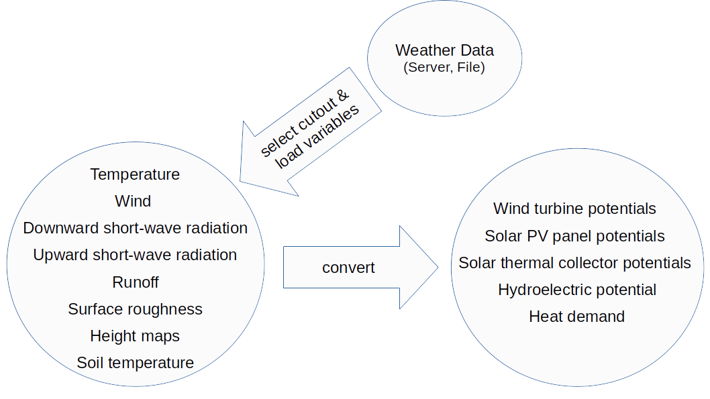

  .. SPDX-FileCopyrightText: Contributors to atlite <https://github.com/pypsa/atlite>

  .. SPDX-License-Identifier: CC-BY-4.0

======
atlite
======

|PyPI version| |Conda version| |Documentation Status| |ci| |codecov| |standard-readme compliant| |MIT-image| |reuse| |black| |pre-commit.ci| |joss| |discord| |stackoverflow|

atlite is a `free software`_, `xarray`_-based Python library for
converting weather data (like wind speeds, solar influx) into energy systems data.
It is designed to be lightweight, keeping computing resource requirements (CPU, RAM) usage low.
It is therefore well suited to be used with big weather datasets.

.. atlite is designed to be modular, so that it can work with any weather
.. datasets. It currently has modules for the following datasets:

.. * `NCEP Climate Forecast System <http://rda.ucar.edu/datasets/ds094.1/>`_ hourly
..   historical reanalysis weather data available on a 0.2 x 0.2 degree global grid
.. * `ECMWF ERA5
..   <https://software.ecmwf.int/wiki/display/CKB/ERA5+data+documentation>`_ hourly
..   historical reanalysis weather data on an approximately 0.25 x 0.25 deg global
..   grid
.. * `EURO-CORDEX Climate Change Projection <http://www.euro-cordex.net/>`_
..   three-hourly up until 2100, available on a 0.11 x 0.11 degree grid for Europe
.. * `CMSAF SARAH-2
..   <https://wui.cmsaf.eu/safira/action/viewDoiDetails?acronym=SARAH_V002>`_
..   half-hourly historical surface radiation on a 0.05 x 0.05 deg grid available
..   for Europe and Africa (automatically interpolated to a 0.2 deg grid and
..   combined with ERA5 temperature).

atlite can process the following weather data fields and can convert them into following power-system relevant time series for any subsets of a full weather database.

.. * Temperature
.. * Downward short-wave radiation
.. * Upward short-wave radiation
.. * Wind
.. * Runoff
.. * Surface roughness
.. * Height maps
.. * Soil temperature
.. * Dewpoint temperature

.. * Wind power generation for a given turbine type
.. * Solar PV power generation for a given panel type
.. * Solar thermal collector heat output
.. * Hydroelectric inflow (simplified)
.. * Heating demand (based on the degree-day approximation)

atlite was initially developed by the `Renewable Energy Group
<https://fias.uni-frankfurt.de/physics/schramm/renewable-energy-system-and-network-analysis/>`_
at `FIAS <https://fias.uni-frankfurt.de/>`_ to carry out simulations
for the `CoNDyNet project <http://condynet.de/>`_, financed by the
`German Federal Ministry for Education and Research (BMBF)
<https://www.bmbf.de/en/index.html>`_ as part of the `Stromnetze
Research Initiative
<http://forschung-stromnetze.info/projekte/grundlagen-und-konzepte-fuer-effiziente-dezentrale-stromnetze/>`_.

Installation
============

To install you need a working installation running Python 3.6 or above
and we strongly recommend using either miniconda or anaconda for package
management.

To install the current stable version:

with ``conda`` from `conda-forge`_

.. code:: shell

       conda install -c conda-forge atlite

with ``pip`` from `pypi`_

.. code:: shell

       pip install atlite

to install the most recent upstream version from GitHub

.. code:: shell

       pip install git+https://github.com/pypsa/atlite.git

Documentation
===============
.. * Install atlite from conda-forge or pypi.
.. * Download one of the weather datasets listed above (ERA5 is downloaded
..   automatically on-demand after the ECMWF
..   `cdsapi<https://cds.climate.copernicus.eu/api-how-to>` client is
..   properly installed)
.. * Create a cutout, i.e. a geographical rectangle and a selection of
..   times, e.g. all hours in 2011 and 2012, to narrow down the scope -
..   see `examples/create_cutout.py <examples/create_cutout.py>`_
.. * Select a sparse matrix of the geographical points inside the cutout
..   you want to aggregate for your time series, and pass it to the
..   appropriate converter function - see `examples/ <examples/>`_

Please check the `documentation <https://atlite.readthedocs.io/en/latest>`_.

Support & Contributing
======================
* In case of code-related **questions**, please post on `stack overflow <https://stackoverflow.com/questions/tagged/pypsa>`_.
* For non-programming related and more general questions please refer to the `pypsa mailing list <https://groups.google.com/group/pypsa>`_.
* To **discuss** with other PyPSA and atlite users, organise projects, share news, and get in touch with the community you can use the `discord server <https://discord.gg/JTdvaEBb>`_.
* For **bugs and feature requests**, please use the `issue tracker <https://github.com/PyPSA/atlite/issues>`_.
* We strongly welcome anyone interested in providing **contributions** to this project. If you have any ideas, suggestions or encounter problems, feel invited to file issues or make pull requests on the `Github repository <https://github.com/PyPSA/atlite>`_.

Authors and Copyright
---------------------

Copyright (C) Contributors to atlite <https://github.com/pypsa/atlite>

See the `AUTHORS`_ for details.

Licence
=======

|MIT-image|

This work is licensed under multiple licences:

-  All original source code is licensed under `MIT`_
-  Auxiliary code from SPHINX is licensed under `BSD-2-Clause`_.
-  The documentation is licensed under `CC-BY-4.0`_.
-  Configuration and data files are mostly licensed under `CC0-1.0`_.

See the individual files for license details.

.. _free software: http://www.gnu.org/philosophy/free-sw.en.html
.. _xarray: http://xarray.pydata.org/en/stable/

.. _conda-forge: https://anaconda.org/conda-forge/atlite
.. _pypi: https://pypi.org/project/atlite/%3E
.. _GitHub: https://github.com/pypsa/atlite

.. _documentation on getting started: https://atlite.readthedocs.io/en/latest/getting-started.html

.. _AUTHORS: AUTHORS.rst

.. _MIT: LICENSES/MIT.txt
.. _BSD-2-Clause: LICENSES/BSD-2-Clause.txt
.. _CC-BY-4.0: LICENSES/CC-BY-4.0.txt
.. _CC0-1.0: LICENSES/CC0-1.0.txt

.. |PyPI version| image:: https://img.shields.io/pypi/v/atlite.svg
   :target: https://pypi.python.org/pypi/atlite
.. |Conda version| image:: https://img.shields.io/conda/vn/conda-forge/atlite.svg
   :target: https://anaconda.org/conda-forge/atlite
.. |Documentation Status| image:: https://readthedocs.org/projects/atlite/badge/?version=master
   :target: https://atlite.readthedocs.io/en/master/?badge=master
.. |standard-readme compliant| image:: https://img.shields.io/badge/readme%20style-standard-brightgreen.svg?style=flat
   :target: https://github.com/RichardLitt/standard-readme
.. |MIT-image| image:: https://img.shields.io/pypi/l/atlite.svg
   :target: LICENSES/MIT.txt
.. |codecov| image:: https://codecov.io/gh/PyPSA/atlite/branch/master/graph/badge.svg?token=TEJ16CMIHJ
   :target: https://codecov.io/gh/PyPSA/atlite
.. |ci| image:: https://github.com/PyPSA/atlite/actions/workflows/test.yaml/badge.svg
   :target: https://github.com/PyPSA/atlite/actions/workflows/test.yaml
.. |reuse| image:: https://api.reuse.software/badge/github.com/pypsa/atlite
   :target: https://api.reuse.software/info/github.com/pypsa/atlite
.. |black| image:: https://img.shields.io/badge/code%20style-black-000000.svg
   :target: https://github.com/psf/black
   :alt: Code style: black
.. |pre-commit.ci| image:: https://results.pre-commit.ci/badge/github/PyPSA/atlite/master.svg
   :target: https://results.pre-commit.ci/latest/github/PyPSA/atlite/master
   :alt: pre-commit.ci status
.. |joss| image:: https://joss.theoj.org/papers/10.21105/joss.03294/status.svg
   :target: https://doi.org/10.21105/joss.03294
.. |discord| image:: https://img.shields.io/discord/911692131440148490?logo=discord
   :target: https://discord.gg/AnuJBk23FU
.. |stackoverflow| image:: https://img.shields.io/stackexchange/stackoverflow/t/pypsa
   :target: https://stackoverflow.com/questions/tagged/pypsa
   :alt: Stackoverflow
