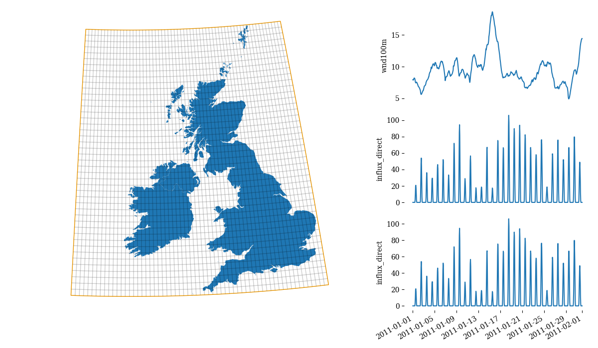
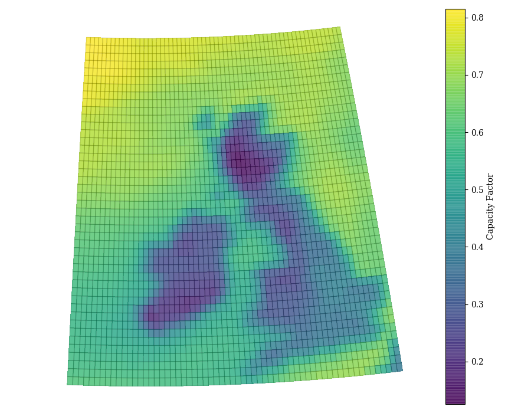
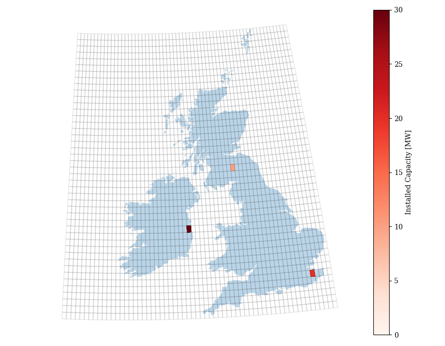
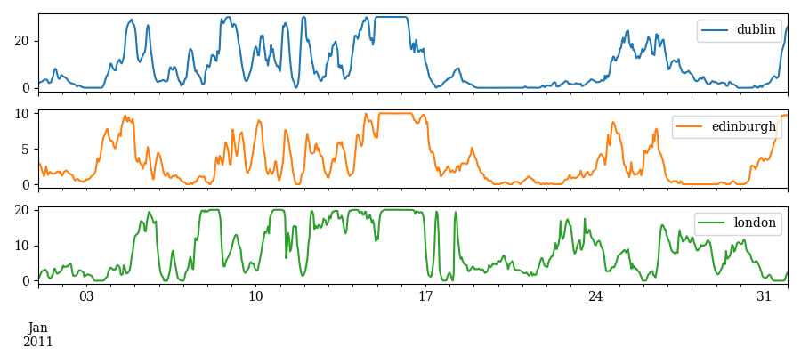
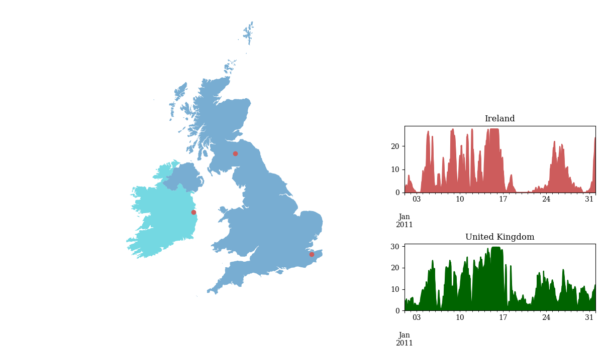

..
  SPDX-FileCopyrightText: Contributors to atlite <https://github.com/pypsa/atlite>

  SPDX-License-Identifier: CC-BY-4.0

############
Introduction
############

atlite processes weather data and converts it into energy system
relevant quantities, mainly you can create data for

* **Wind** power generation: Using predefined or custom turbine properties
  and smoothing options for modelling more realistic results.
  *New:* Turbines can also be imported from the
  `Open Energy Database <https://openenergy-platform.org/dataedit/view/supply/wind_turbine_library>`_.
* **Solar (PV)** power generation: Using predefined or custom panel properties.
* **Solar (thermal)** heat generation from solar collectors.
* **Hydro (run-off)** power generation.
* **Heating demand** (based on degree-day approx.).

How it works
========================

Starting from a global weather dataset, *e.g.* our standard data source ECMWF's ERA5 dataset,

atlite enables you to create a **cutout**, a spatial and
temporal subset of the original data which includes all relevant data
such as wind velocity, influx, temperature etc.

The **cutout** consists of grid cells of a certain resolution (depending on your input data, here 30 km x 30 km)
each having its own weather timeseries.
The **cutout** builds the starting point to your calculations.

From there, you can extract various quantities and general properties of the data, *e.g.* wind capacity factors per grid cell

for a specific turbine type (this gives you information on the share of capacity which is in average running and producing power).

Further, you can set power plants to specific spots and let atlite calculate their actual power production. The **capacity layout**  specifies which grid cell contains what amount of capacity of *one* production type. atlite comes along with a small `library of wind turbine configurations and PV panel configurations <https://github.com/PyPSA/atlite/tree/master/atlite/resources>`_  which you can directly use, *e.g.* 'Vestas_V112_3MW' wind turbines.

atlite then calculates the power generation data for each cell and either aggregates them to buses

or to geometrical shapes

Whereas for the first case, grid cells must directly be assigned to buses by passing a matrix of size :math:`N_{cell} \times N_{bus}`, for the second case, the aggregation to shapes takes place in atlite itself: It creates the mentioned matrix, the so-called **indicator matrix**, which contains the spatial overlap of each grid cell (weighted by the capacity layout if present) with each shape. This is why the shapes can the very refined and even smaller than the grid cells. In our example the **indicator matrix** for the shape of United Kingdom without being weighted by the **capacity layout** looks like this

.. image:: img/indicator_matrix.png
    :align: center
    :width: 400pt

Datasets
==================

The standard data source we currently employ is ECMWF's ERA5 dataset
(reanalysis weather data in a ca. 30 km x 30 km and hourly resolution).
This dataset is easily available at no additional costs and requires only
minimal setup from the user in comparison to other datasets.
It is downloaded automatically on-demand after the
`ECMWF ADS API <https://cds.climate.copernicus.eu/how-to-api>`_
(European Centre for Medium-Range Weather Forecasts Climate Data Store
Application Program Interface) client is properly installed. See separate,
linked installation guide for details, especially for correctly setting up
your CDS API key.

Previously and in the future other datasets where and (hopefully) will
again be usable, including

* the *NCEP Climate Forecast System* dataset
* the *EURO-CORDEX Climate Change Projection* dataset
* the *CMSAF SARAH-2* dataset
* Satellite based radiation observations, e.g. SARAH-2.
* Weather data forecasts from climate models.

Their support however is currently on hold (time limitation on developer
side).

If you need to process these (or other) data sources, feel free to
file an issue on our `GitHub <https://github.com/PyPSA/atlite>`_ or (even better) create a pull request!

What atlite does not cover (yet)
=================================

* atlite does not provide and **graphical user interface** (GUI) and relies on prior knowledge on working with Python commands.

* atlite does not provide **exact prediction** of the time-series generation at high resolution in a **future point** in time. The spatial resolution of the  results is limited by the input data used. The accuracy of the results is in parts limited by the methodologies used for translating weather data into generation and the underlying assumptions. With the current assumptions atlite is not suited for predicting the output of single wind turbines or solar panels.

* As the results of atlite are theoretical and are not validated per se, and while usually a good approximation, can **deviate significantly from reality**. While in the past and also at the moment datasets generate by packages similar to atlite where commonly used without a comparison and validation with reality, there is currently a trend to validate the datasets before using them to make sure that results are at least plausible. The atlite team is planning to include auxiliary functions which help to validate generated datasets.
