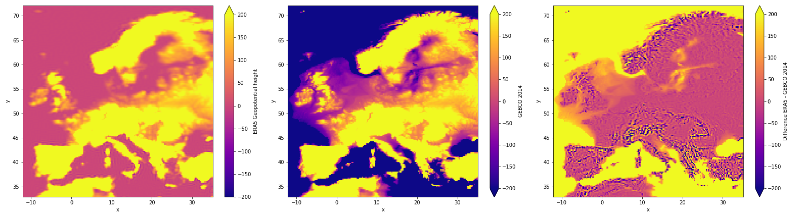

..
  SPDX-FileCopyrightText: 2016-2019 The Atlite Authors

  SPDX-License-Identifier: CC-BY-4.0

################
Creating cutouts
################

Cutouts build the core of Atlite. Once created one, you can easily derive energy system 
relevant data. 
They include all necessary weather data within your temporal and spatial boundaries. 
The following weather data fields can be processed

* Temperature
* Downward short-wave radiation
* Upward short-wave radiation
* Wind 
* Runoff
* Surface roughness
* Height maps
* Soil temperature

And from there, following energy system relevant time series can be derived

* Wind power generation for a given turbine type
* Solar PV power generation for a given panel type
* Solar thermal collector heat output
* Hydroelectric inflow (simplified)
* Heating demand (based on the degree-day approximation)

When creating cutouts, the spatial and temporal extent need to specified as well
as the dataset to base the cutout on. At the moment the ERA5 and SARAH datasets
are supported by atlite.

The creation of cutouts based on the ERA5 dataset is automized in Atlite. 
Using `GeoPandas <http://geopandas.org/>`_ one can easily build cutouts for 
one or more countries at a time instead of manually providing the spatial extent

.. code-block:: python

    In [1]: import atlite
    In [2]: import geopandas as gpd

    
    In [3]: baltics = gpd.read_file(gpd.datasets.get_path('naturalearth_lowres'))\
                 .set_index('name')\
                 .reindex(['Estonia', 'Lithuania', 'Latvia' ])

In order to define the spatial bounds of the cutout, we pass the geometrical 
bounds of the union of all shapes in the GeoPandas.GeoSeries.  

.. code-block:: python

    In [4]: cutout = atlite.Cutout(path="baltics-2011-01.nc",
                            module="era5",
                            bounds=baltics.unary_union.bounds,
                            time="2011-01")

Likewise the bounds can also be passed as a tuple of form ``(min.lon, min.lat, max.lon, max.lat)``
For the same result as above, one can thus write:

.. code-block:: python

    In [4]: cutout = atlite.Cutout(path="baltics-2011-01.nc",
                            module="era5",
                            bounds=(21.055800408622417, 53.905702216194754, 28.17670942557794, 59.61109039981133)
                            time="2011-01")

or with the x and y arguments:

.. code-block:: python

    In [4]: cutout = atlite.Cutout(path="baltics-2011-01.nc",
                            module="era5",
                            x=(21.05, 28.17),
                            y=(53.90,59.61),
                            time="2011-01")

The ``path`` points to the location where the cutout will be stored, the file ending `.nc` is optional.

After the cutout is described, it then has to be created ("prepared").
The preparation of a cutout may take some time depending on the queueing time of your request
and your computational resources:

.. code-block:: python

    In [5]: cutout.prepare()

An existing ``cutout`` is loaded with the same command above used for describing it.
If ``atlite`` finds the already prepared cutout, subsequent calls to ``.prepare()`` have
by default no effect (there is a force switch to recreate a cutout).

===========================
Using GEBCO as a height map
===========================

.. note::
    It is strongly recommended to use the GEBCO height when accurate height's are required,
    e.g. when excluding offshore locations for wind turbines.

Cutout created using ERA5 contain the geopotential ``height`` popular in metrology.
This height measure is similar but not equivalent to height measures "above sea level" and
is especially inaccurate in sea regions.

To use more a more precise height measure, atlite allows to create cutouts using the GEBCO
datasets, which contains very precise height maps for sea as well as land areas.

To utilise GEBCO for a cutout, the dataset first has to be manually downloaded from the 
`GEBCO website <https://www.gebco.net/data_and_products/gridded_bathymetry_data/>`_ in the "netCDF"
and uncompressed manually. The GEBCO 2014 as well as GEBCO 2019 release are supported, with the
later being a bit more accurate at a higher resolution, but subsequently significantly larger as the former.
In the cutout creation the additional argument `gebco_path` then has to be pointed to the 
location to where the ``GEBCO_<year>.nc`` file was extracted to.
The cutout is then finally prepared as usually:

.. code-block:: python

    In [4]: cutout = atlite.Cutout(path="baltics-2011-01.nc",
                            module="era5",
                            gebco_path="./GEBCO_2014.nc",
                            x=(21.05, 28.17),
                            y=(53.90,59.61),
                            time="2011-01")

GEBCO uses a higher resolution as ERA5, thus the height map from GEBCO is rescaled using a weighted
average to coincide with the ERA5 raster.
The difference in heights between ERA5 and GEBCO for cutouts is shown below, underlining the difference
when working on offshore locations:

Atlite internally uses the ``height`` attribute for some operations.
Using GEBCO thus will produce slightly different results, e.g. for ``runoff()`` calculations, than ERA5.